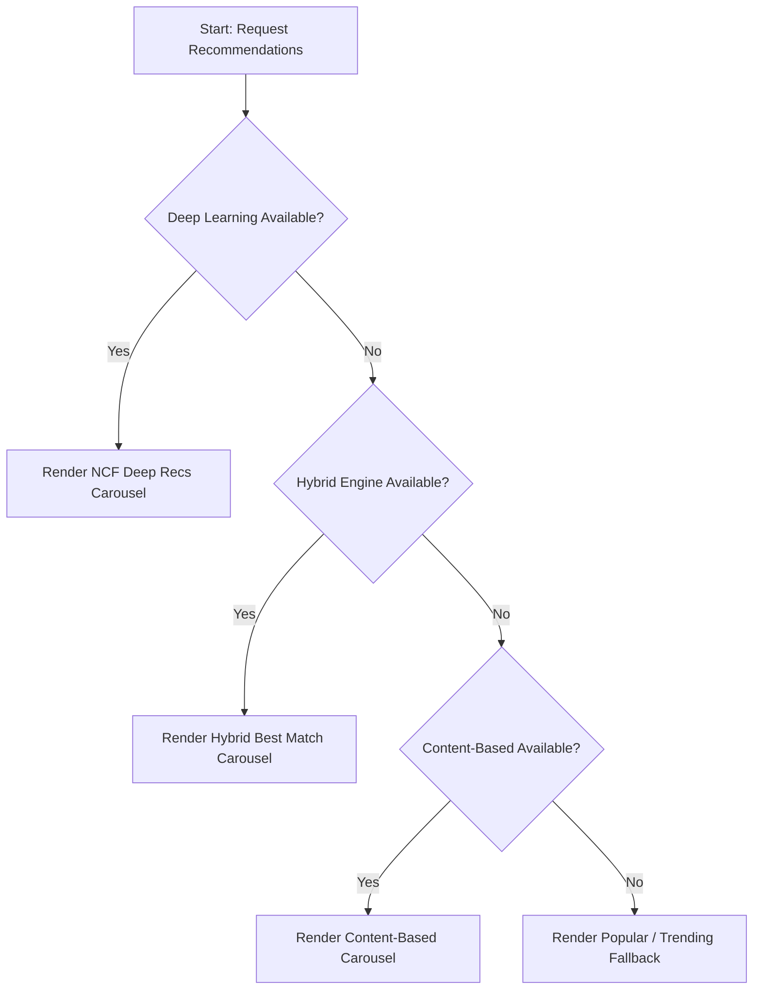

# AI Architecture & Discovery System - AnimeVerse

This document provides a comprehensive overview of the AI and recommendation subsystems implemented in AnimeVerse.

---

## 1. Recommendation Engine Pipeline

AnimeVerse uses a hierarchical fallback recommendation architecture designed to maximize recommendation quality while ensuring high availability.

### Fallback Strategy Workflow



1. **Deep Learning (NCF) Model**: First priority. Uses Neural Collaborative Filtering to generate highly personalized scores based on user-item interaction matrices.
2. **Hybrid Engine**: Second priority. Combines content similarity scores and collaborative neighborhood tallies, reinforced by real-time user feedback.
3. **Content-Based Filtering**: Third priority. Personalizes selections based on TMDB genre profiles and watch history seeds.
4. **Popular / Trending Fallbacks**: Final safeguard. Delivers highly rated weekly popular shows and movies.

---

## 2. Neural Collaborative Filtering (NCF) Architecture

The NCF model is implemented in PyTorch/TensorFlow (Keras) and trained offline on local interaction matrices.

### Model Architecture & Embeddings
- **Input Layers**: User IDs and Content IDs are mapped to continuous, dense embeddings.
- **Embeddings Size**: $16$-dimensional embeddings learn high-level latent concepts (e.g., genre associations, franchise interest groups).
- **Concatenation Layer**: Combines user and content embeddings.
- **Multi-Layer Perceptron (MLP)**:
  - Dense Layer 1: 64 units (ReLU activation)
  - Dense Layer 2: 32 units (ReLU activation)
  - Dense Layer 3: 16 units (ReLU activation)
- **Output Layer**: A single neuron with a Sigmoid activation function outputs the predicted interaction score (ranging from $0.1$ to $1.0$).

### Index Mapping & Serialization
- Offline script `ml/train_model.py` maps Firestore `uid` (strings) and `contentId` (numbers) to integer indices (`0` to $N-1$).
- Mappings and models are serialized to `ml/deep_model_meta.joblib` and `ml/trained_model.h5`.
- Pre-computed recommendations for active users are written to `ml/deepRecommendations.json` for rapid sync.

---

## 3. Database Schema & Caching Layer

To optimize database reads and writes, AnimeVerse integrates a dual-tier storage system (In-Memory Cache + Firestore).

### Firestore Data Schema

#### `deepRecommendations` (Collection)
- **Document ID**: `{uid}`
- **Fields**:
  - `recommendations`: Array of items:
    ```json
    {
      "contentId": 40748,
      "title": "Jujutsu Kaisen",
      "mediaType": "anime",
      "score": 0.9248
    }
    ```

#### `recommendationMetrics` (Collection)
Tracks daily precision, impressions, clicks, saves, and watches.
- **Document ID**: `YYYY-MM-DD`
- **Fields**:
  - `clicks`: total recommendation card clicks.
  - `saves`: total favorites or watchlist additions.
  - `watches`: total watch activations.
  - `impressions`: total cards rendered on user screens.
  - `accuracyScore`: `(saves + watches) / clicks` (percentage).

### Caching Architecture
- **In-Memory Cache**: `db.js` stores user lists (watchHistory, favorites, watched, myList) and recommendations in memory.
- **Bypass Rule**: Reads check memory first, avoiding Firebase quota consumption. Caches are updated automatically on write (`syncStorageToDb`) and wiped immediately on logout to prevent session crossover.

---

## 4. Query Validation & Safety

The AI Assistant is protected against injection vulnerabilities and load spikes:
- **Length Boundary**: Enforces a strict query length boundary of $150$ characters.
- **Sanitization regex**: Sanitizes and blocks strings containing unsafe characters `/[\<\>\$\{\}\[\]\;\\\/]/` to defend Firestore queries from NoSQL injection and protect client layouts from cross-site scripting (XSS).
