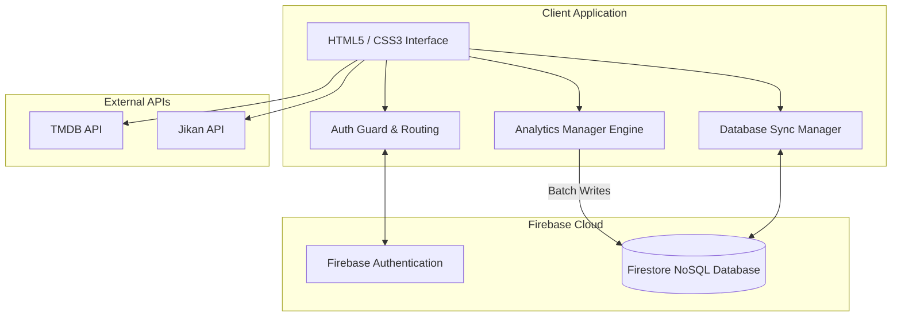

# Portfolio Package: AnimeVerse 🌌

**Project Type:** Full-Stack Web Application / Progressive Web App (PWA)
**Ideal For:** BCA Final Year Project, Internship Applications, GitHub Portfolio

## 📖 Project Overview

AnimeVerse is a comprehensive, production-ready content discovery platform built entirely with modern web technologies. It aggregates data from multiple APIs to provide a unified experience for anime and movie enthusiasts. The project highlights a deep understanding of asynchronous JavaScript, REST API integration, cloud NoSQL databases, and real-time state management without relying on heavy frontend frameworks like React or Angular.

### Key Technical Achievements:
- **Custom AI Recommendation Engine:** Developed an algorithm that computes a dynamic score for titles based on user engagement metrics (favorites, watch history, and click-through rates).
- **Scalable Analytics Layer:** Implemented a batched-write analytics queue that minimizes Firebase read/write costs while capturing highly granular data (Daily Active Users, Failed Searches, Detail Views).
- **Security & Authorization:** Structured Firestore rules and client-side guards to separate standard user functionality from an advanced Administrator Dashboard.
- **PWA Capabilities:** Service worker integration for offline caching, fast load times, and installability on mobile devices.

---

## 🏗 Architecture Diagram

---

## 🚀 Feature List

1. **Unified Content Catalog:** Merges Anime, Movies, and TV Series into a single seamless interface.
2. **User Profiles:** Tracks Viewing Streaks, Recently Watched items, and provides an interactive Activity Timeline.
3. **Advanced Administration:** Dedicated dashboard charting platform growth, search analytics, and most popular content.
4. **Offline Support:** Caches core files using a Service Worker for immediate loading.
5. **Smart Search:** Handles cross-API querying with fallback mechanisms and failed-search logging for platform administrators.

---

## 🛤 Future Roadmap

While AnimeVerse is highly functional, the following enhancements could be built to extend the platform:

1. **Social Integration:** Allow users to share their "My List" or follow friends' viewing activities.
2. **Machine Learning Model:** Upgrade the recommendation engine from a heuristics-based scoring algorithm to a TensorFlow.js collaborative filtering model.
3. **Real-time Chat:** Implement an episode discussion feature using Firestore's `onSnapshot` real-time listeners.
4. **Push Notifications:** Notify users when new episodes of their favorited shows are released.
